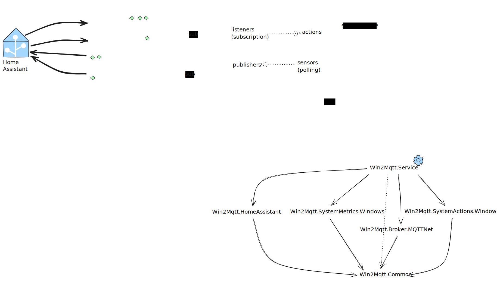

# Windows to MQTT

A Windows service that exposes system sensors to MQTT so that they can be consumed from IOT applications such as Home Assistant

## Roadmap

See [Roadmap](./docs/Roadmap.md).

## Architecture

[](./docs/architecture-2022-12-13-0943.excalidraw)

The application is a Windows Service that runs in the background, collects system information, and 
publishes it to an MQTT broker. 

It uses the MQTT protocol to communicate with the broker and publish sensor data.

## Installation

### Microsoft Windows

Install as a **Windows Service**

First, build a a self-containing exe:

```powershell
dotnet publish .\src\Win2Mqtt\ --configuration Release --framework net8.0-windows8.0 --runtime win-x64 --self-contained  --output c:\Win2MQTT
```

Then create and start the service (you will need Administration privileges):

```powershell
sc.exe create "Win2MQTT Service" binpath= "C:\Win2MQTT\Win2Mqtt.exe"
sc.exe start "Win2MQTT Service"
```

More information in [this article](https://learn.microsoft.com/en-us/dotnet/core/extensions/windows-service)

### Linux

Install as a **Linux Service**

First, build a a self-containing exe:

```powershell
dotnet publish ./src/Win2Mqtt --configuration Release --framework net8.0 --runtime linux-x64 --self-contained  --output ./publish
```

Or directly, get the la version from the [releases](https://github.com/ferarias/win2mqtt/releases/) section

```bash
wget https://github.com/ferarias/win2mqtt/releases/download/v0.0.2-beta3/win2mqtt-ubuntu-latest.tar.gz
```

Then extract the files:

```bash
sudo mkdir -p /opt/win2mqtt
sudo tar -xvzf win2mqtt-ubuntu-latest.tar.gz -C /opt/win2mqtt
```

Then create and start the service


### Install as a Linux Service (systemd)

To run Win2MQTT as a background service (daemon) on Linux, you can use systemd. Follow these steps:
   
Adjust the output path as needed.

2. **Create a systemd service file**

   Create a file at `/etc/systemd/system/win2mqtt.service` with the following content (edit paths if necessary):
   
   ```ini
   [Unit]
   Description=Win2MQTT Service
   After=network.target

   [Service]
   Type=simple
   WorkingDirectory=/opt/win2mqtt
   ExecStart=/usr/bin/dotnet /opt/win2mqtt/win2mqtt.dll
   Restart=on-failure
   User=win2mqtt
   Environment=ASPNETCORE_ENVIRONMENT=Production

   [Install]
   WantedBy=multi-user.target
   ```

3. **Create the service user (optional but recommended)**

   ```bash
   sudo useradd --system --no-create-home --group win2mqtt
   sudo chown -R win2mqtt:win2mqtt /opt/win2mqtt
   ```

4. **Reload systemd and enable the service**

   ```bash
   sudo systemctl daemon-reload
   sudo systemctl enable win2mqtt
   sudo systemctl start win2mqtt
   ```

5. **Check the service status**

   ```bash
   sudo systemctl status win2mqtt
   ```

Win2MQTT will now run as a background service and start automatically on boot.

## Sensors

Sensors are published to Home Assistant, provided it has the MQTT integration enabled.

The default topic is `win2mqtt/{hostname}` where `{hostname}` is the name of the computer running the service.
The hostname is automatically detected and used as the prefix for all topics.

See [Sensors](./docs/Sensors.md) to see the list of available sensors and their topics.

## Listeners

Win2MQTT subscribes to several topics and, when receiving messages, executes a command or action.

See [Listeners](./docs/Listeners.md) to see the list of available listeners and their topics.

## Setup project

(in progress)

From https://learn.microsoft.com/en-us/dotnet/core/extensions/windows-service-with-installer?tabs=wix