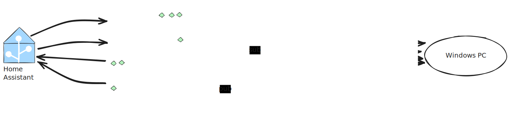

# Windows to MQTT

A Windows service that exposes system sensors to MQTT so that they can be consumed from IOT applications such as Home Assistant

## Architecture

The application is a Windows Service that runs in the background, collects system information, and publishes it to an MQTT broker. 

It uses the MQTT protocol to communicate with the broker and publish sensor data.

## Installation

In both Linux and Windows there's an installer available. Keep these values at hand before installing

- **Hostname**, **port** and (optional) **credentials** for your MQTT broker.
- A **device identifier**, usually your system/device/machine hostname.

### Windows

1. Get the latest Windows installer from the [releases](https://github.com/ferarias/win2mqtt/releases/) section: `Win2MqttSetup.exe`
2. Double-click the installer and follow the instructions.
3. That's all. Win2MQTT will be installed as a Windows Service.
4. You can further customize settings in `%LOCALAPPDATA%\Win2Mqtt\win2mqtt.appsettings.json`

### Linux

1. Get the latest Linux version from the [releases](https://github.com/ferarias/win2mqtt/releases/) section.  
`
wget https://github.com/ferarias/win2mqtt/releases/download/v0.0.3-beta03/win2mqtt-ubuntu-latest.tar.gz`

1. Extract the package:  
`tar -xzfv win2mqtt-ubuntu-latest.tar.gz`

1. Run the installer and follow the instructions  
`cd win2mqtt`  
`chmod +x uninstall.sh`  
`./install.sh`

1. You can further customize settings in `/etc/mqtt/win2mqtt.appsettings.json`

1. To uninstall:  
`cd win2mqtt`  
`chmod +x uninstall.sh`  
`./uninstall.sh`

## Sensors

Sensors are published to Home Assistant, provided it has the MQTT integration enabled.

The default topic is `win2mqtt/{hostname}` where `{hostname}` is the name of the computer running the service.
The hostname is automatically detected and used as the prefix for all topics.

See [Sensors](./docs/Sensors.md) to see the list of available sensors and their topics.

## Listeners

Win2MQTT subscribes to several topics and, when receiving messages, executes a command or action.

See [Listeners](./docs/Listeners.md) to see the list of available listeners and their topics.

## Roadmap

See [this document](./docs/Roadmap.md) to find out what I intend to do in the future.

## Setup

See [this document](./docs/setup.md) to understand how the installers work.